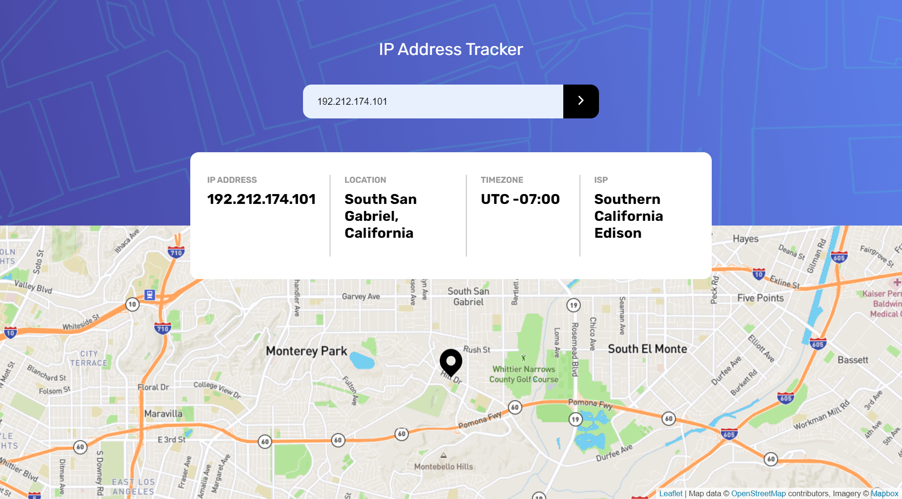

# Frontend Mentor - IP Address Tracker solution

This is a solution to the [IP Address Tracker challenge on Frontend Mentor](https://www.frontendmentor.io/challenges/order-summary-component-QlPmajDUj). Frontend Mentor challenges help you improve your coding skills by building realistic projects.

## Table of contents

- [Overview](#overview)
  - [The challenge](#the-challenge)
  - [Screenshot](#screenshot)
  - [Links](#links)
- [My process](#my-process)
  - [Built with](#built-with)
  - [What I learned](#what-i-learned)
  - [Continued development](#continued-development)
  - [Useful resources](#useful-resources)
- [Author](#author)

## Overview

### The challenge

Users should be able to:

- Get IP address and get location details

### Screenshot

### Links

- [Solution URL](https://www.frontendmentor.io/solutions/ip-address-tracker-with-html-css-javascript-vbO8tnmyL)

- [Live Site URL](https://hannah-mazri.github.io/frontendmentor/ipaddress-tracker)

## My process

### Built with

- Semantic HTML5 markup
- CSS custom properties
- Flexbox
- Mobile-first workflow

### What I learned

- leaflet.js
- mapbox API

### Continued development

- To add error messages

### Useful resources

- [leaflet.js Docs](https://leafletjs.com)

## Author

- Website - [hann.fyi](https://hann.fyi)
- Frontend Mentor - [@hannah-mazri](https://www.frontendmentor.io/profile/hannah-mazri)
- Twitter - [@hannahnjw](https://www.twitter.com/hannahnjw)
